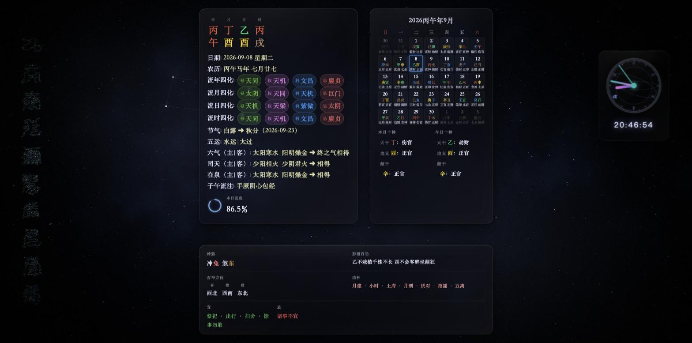
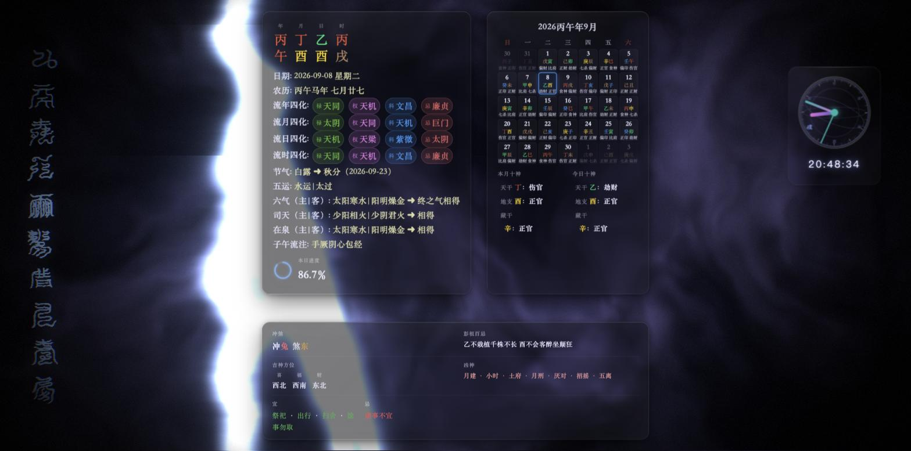
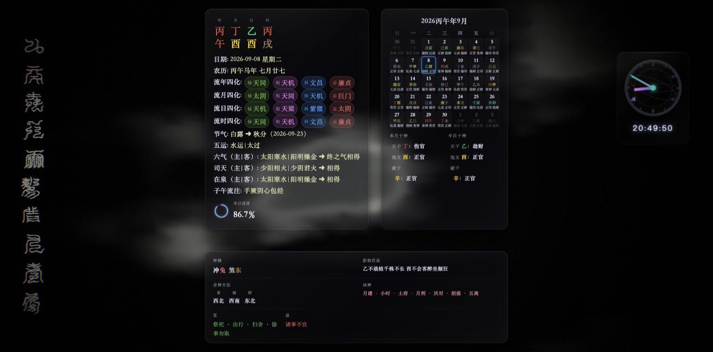
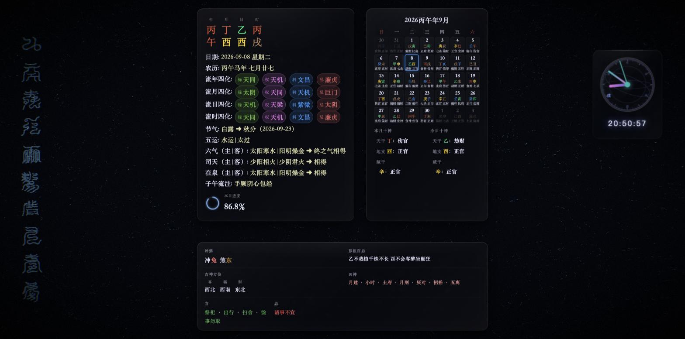
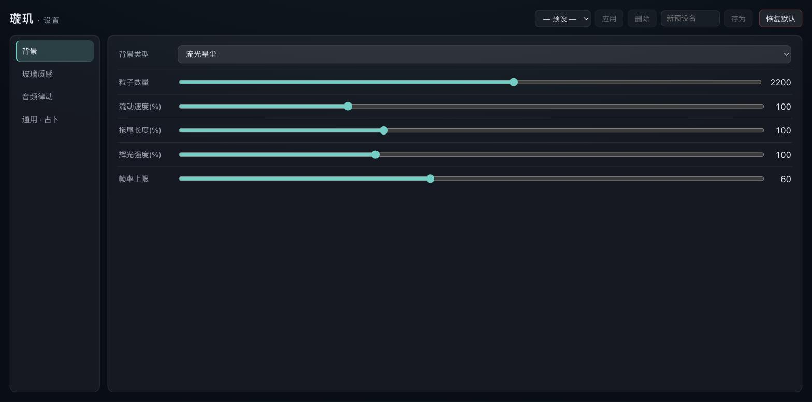

<div align="center">

# 璇玑 · Xuanji

**东方玄学动态壁纸 · Oriental Metaphysics Live Wallpaper**

将八字命理、紫微斗数、五运六气与万年历，融进一层随声起伏、逐日换色的活壁纸。

[](#平台支持)
[](#平台支持)
[](#技术架构)
[](#四特效)
[](#配置与设置)



</div>

---

「璇玑玉衡」是上古演算天象历数的旋转天文仪器，北斗第二、三星亦名天璇、天玑。
**璇玑** 取其意——一具在桌面上不停演算天时的仪器：它算你的八字、今日四化、当值经络与宜忌，
再把这份「天时」化作星空、水墨、雷法或流光，铺满你的桌面。

## 特性

- 🀄 **完整的东方玄学面板** —— 八字大四柱、流年/月/日/时紫微四化、五运六气、万年历、个人十神、子午流注，以及一具叠加二十八宿与十二地支的**浑天仪星盘时钟**。
- 🎨 **四款原生 WebGL2 特效背景** —— 星汉灿烂 / 水墨氤氲 / 雷霆万钧 / 流光星尘，各带泛光、颗粒、暗角与边缘色散的后期处理管线。
- 🔊 **系统声音律动** —— 无需授权的 loopback 采集 + FFT，可按**真实 Hz 区间**（低频/中频/高频）分频驱动特效起伏。
- 🖱️ **鼠标交互** —— 光标拂过桌面即起涟漪：流光生漩涡气眼、雷霆朝指尖劈落、水墨随手搅动、星空视差微移（点击穿透、不夺焦、不打扰）。
- 🌗 **五行配色** —— 读当日**日干**推五行，木青 / 火赤 / 土黄 / 金白 / 水玄，特效与星盘光晕每日自动换色。
- 🎛️ **每款特效各一套专属参数** —— 星点密度、墨量、闪电频率、粒子数量……默认即原观感，随手可调。
- 🪟 **原生壳、逐像素等同网页核心** —— Windows 走 WorkerW 挂桌面壁纸层，macOS 沉 `NSWindow` 至图标之下、跨全部 Space、点击穿透。
- ⚙️ **数据驱动的设置面板** —— 毛玻璃设置窗、参数热重载（改即生效不重启）、命名预设、**每显示器独立配置**。
- 🔋 **省电友好** —— 前台出现全屏应用（游戏 / 全屏视频）自动暂停渲染，可设帧率上限，开机自启可选。

## 四特效

<table>
  <tr>
    <td width="50%" align="center">
      <br />
      <b>星汉灿烂</b><br /><sub>星云 · 繁星闪烁 · 北斗连线 · 银河带 · 偶发流星</sub>
    </td>
    <td width="50%" align="center">
      <br />
      <b>雷霆万钧</b><br /><sub>翻涌暗云 · 程序化闪电分叉 · 击闪辉光</sub>
    </td>
  </tr>
  <tr>
    <td width="50%" align="center">
      <br />
      <b>水墨氤氲</b><br /><sub>半拉格朗日流体平流 · 焦墨飞白 · 墨随流卷</sub>
    </td>
    <td width="50%" align="center">
      <br />
      <b>流光星尘</b><br /><sub>数千 GPU 粒子沿曲线噪声场漂流 · 丝缕拖尾流线</sub>
    </td>
  </tr>
</table>

> 四款特效均作为 `bgtype` 选项，与粒子 / 渐变 / 纯色 / 图片 / 视频 / 轮播互斥可切；
> 每款特效在笔画处还会「生长」出雷祖圣号「九天应元雷声普化天尊」的篆法竖幅。

## 配置与设置

<div align="center">
  
</div>

设置面板由 `project.json` 单一 schema 驱动——加一个参数零 Rust 改动。分「背景 / 玻璃质感 / 音频律动 / 通用·占卜」四区，
按当前背景类型联动显隐；改动实时下发壁纸、命名预设可存取、多屏时可对每块屏单独配置。

## 平台支持

| 平台 | 架构 | 状态 | 说明 |
| --- | --- | --- | --- |
| **Windows 11** / Windows 10 22H2 | x64 · arm64 | ✅ 壁纸层 / 鼠标 / 音频 / 毛玻璃 / 开机自启 | 依赖 WebView2 Runtime（Win11 自带） |
| **macOS** 14.6 Sonoma 及以上 | Apple Silicon · Intel | ✅ 全功能 | 音频律动地板 = 14.6（CoreAudio process tap） |
| Linux（wlroots） | — | 🚧 后续 | — |

> 不打包 Chromium：Windows 用系统 WebView2、macOS 用系统 WKWebView，安装包因此极小。

## 技术架构

核心决策：**保留 Web 核心，用 Rust 造壳。** 那份占卜网页本质是复杂的 CJK 排版 + 玻璃拟态，
是 HTML/CSS 的主场；原生重写文字引擎方向相反且有「做得比原版差」的风险。保留 Web 核心 =
逐像素等同原版，天然锁死质量地板；要着色器就走 WebView 内的 WebGL2 canvas，增量叠加、原模式永远兜底。

| 层 | 选型 |
| --- | --- |
| 窗口 / WebView 壳 | `tao` + `wry`（系统内置引擎，不打包 Chromium） |
| Windows 壁纸层 | `windows` crate —— Progman `0x052C` → WorkerW → `SetParent` |
| macOS 壁纸层 | `objc2` + `objc2-app-kit` —— `NSWindow` 沉 desktop+1、全 Space、点击穿透 |
| 音频 | `cpal`（loopback）+ `rustfft`（128 段对数分桶 FFT） |
| 特效 | WebGL2（星云 / 流体 / transform-feedback GPU 粒子 / 全屏 shader）+ 后期处理 |
| 设置窗 | Svelte 5 + TypeScript（Vite），schema 数据驱动 |
| 资源内嵌 | `rust-embed`（release 把 `web/` 打进单个二进制） |

```
┌─ Rust 壳 ───────────────────────────────────────────────┐
│  tao 窗口  ├─ os/ 壁纸层（WorkerW / NSWindow）            │
│            ├─ audio/ loopback + FFT ──┐                  │
│            ├─ settings/ schema + 持久化 │  evaluate_script │
│            └─ ipc/ 设置窗 ↔ 壳          ▼                  │
│  wry WebView（系统引擎）                                   │
│    └─ web/  占卜核心（HTML/JS）+ WE shim                   │
│              └─ effects/ WebGL2 四特效 + 后期处理          │
└──────────────────────────────────────────────────────────┘
```

## 从源码构建

**前置**：[Rust](https://rustup.rs)（stable）、[Node.js](https://nodejs.org) 18+（仅为构建 Svelte 设置窗）。

```bash
# 1) 构建设置窗（Svelte/Vite → web/settings/dist，release 内嵌需要）
cd web/settings && npm ci && npm run build && cd ../..

# 2a) 开发运行（debug 运行时读源码树，改 web/ 即时生效）
cargo run

# 2b) 发布构建（当前平台）
cargo build --release        # 产物：target/release/xuanji[.exe]
```

**从 macOS 交叉编译 Windows 包**（静态链接 CRT，单文件零依赖）：

```bash
brew install llvm lld
cargo install cargo-xwin
rustup target add x86_64-pc-windows-msvc
RUSTFLAGS="-C target-feature=+crt-static" \
  cargo xwin build --release --target x86_64-pc-windows-msvc
```

调试预览单个特效（无需壳）：`python3 -m http.server` 后打开 `web/index.html?fx=<特效名>`（`starfield`/`ink`/`thunder`/`flowfield`）。

## 使用

双击运行后壁纸即挂到桌面（图标背后）。右下角 / 菜单栏托盘的**太极图标**提供：

- **背景** —— 在纯色 / 粒子 / 图片 / 视频 / 轮播 / 四特效间切换（勾选当前项）
- **设置…** —— 打开毛玻璃设置窗
- **退出**

## 路线图

- [x] macOS 全链路（壁纸层 / 四特效 / 后期 / 音频 / 鼠标 / 五行 / 星盘 / UI）
- [x] 设置系统（schema 驱动 · 热重载 · 命名预设 · 每屏独立配置 · 资源内嵌）
- [x] Windows 壁纸层（WorkerW，24H2 实测）+ 鼠标交互 + Acrylic 毛玻璃 + 音频
- [x] 每特效专属参数 · 音频 Hz 分频 · 开机自启 · 帧率上限 · 全屏暂停省电
- [x] CI / Release 工作流（四架构预编译包）
- [ ] 安装包：Windows MSI/NSIS、macOS `.app` + dmg + 签名公证
- [ ] 多显示器坐标真机核验 · DWM 崩溃后自动重建
- [ ] Linux（Wayland / wlroots）

## 由来

源自一款 Wallpaper Engine 壁纸的占卜网页核心。脱离 WE 后，壳侧自行补上桌面壁纸层描画、
系统音频 FFT、原生文件对话框与设置注入——页面「以为自己还在 Wallpaper Engine 里」。

## 许可

本项目暂未选定开源许可证，发布前保留所有权利（All rights reserved）。
